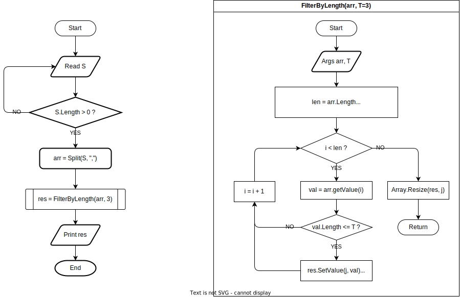

# Выбор специализации. IT-специалист

## Итоговая проверочная работа

### Постановка задачи

Написать программу, которая из имеющегося массива строк формирует новый массив из строк, длина которых меньше, либо равна 3 символам. Первоначальный массив можно ввести с клавиатуры, либо задать на старте выполнения алгоритма. При решении не рекомендуется пользоваться коллекциями, лучше обойтись исключительно массивами.

Примеры:

```
[“Hello”, “2”, “world”, “:-)”] → [“2”, “:-)”]
[“1234”, “1567”, “-2”, “computer science”] → [“-2”]
[“Russia”, “Denmark”, “Kazan”] → []
```

### План

- [x] Создать репозиторий на GitHub
- [x] Нарисовать блок-схему алгоритма 
- [x] Снабдить репозиторий оформленным текстовым описанием решения (файл README.md)
- [x] Написать программу, решающую поставленную задачу
- [x] Использовать контроль версий в работе над этим небольшим проектом (не должно быть так, что всё залито одним коммитом, как минимум этапы 2, 3, и 4 должны быть расположены в разных коммитах)

### Блок-схема алгоритма



### Разработка

Для работы с проектом требуется .NET версии 6 или старше. Скачайте и установите [.NET пакет SDK](https://dotnet.microsoft.com/en-us/download/dotnet) на компьютере.

Проект реализован в виде трех пакетов:
- `ArrayFilter` содержит библиотеку, реализующую два варианта функции фильтрации элементов массива по длинне
    - `ByLength(string[] arr, int maxLength = 3)` возвращает массив, содержащий все элементы массива `arr` не длинее `maxLength`
    - `ByLength(string[] arr, int maxLength = 3)` реализует тот же функционал без использования встроенной функции [`Array.FindAll`](https://learn.microsoft.com/ru-ru/dotnet/api/system.array.findall?view=net-6.0)
- `ArrayFilter.Tests` содержит модульные тесты для обеих реализаций фунцкции фильтрации массива
- `ArrayFilter.CLI` содержит консольное приложение, принимающее входной массив от пользователя и печатающее все элементы массива не длинее трех символов

Для запуска приложения удобно использовать `dotnet run`:

```shell-session
$ dotnet run --project ArrayFilter.CLI
Enter comma-separated list of elements and press enter: Hello, 2, world, :-)

["Hello", "2", "world", ":-)"] -> ["2", ":-)"]
```

Для запуска модульных тестов используйте `dotnet test`:

```shell-session
$ dotnet test

Microsoft (R) Test Execution Command Line Tool Version 17.2.0 (arm64)
Copyright (c) Microsoft Corporation.  All rights reserved.

Starting test execution, please wait...
A total of 1 test files matched the specified pattern.

Passed!  - Failed:     0, Passed:     6, Skipped:     0, Total:     6, Duration: 2 ms
```

Чтобы посмотреть список имеющихся тестов: 

```shell-session
$ dotnet test --list-tests

Microsoft (R) Test Execution Command Line Tool Version 17.2.0 (arm64)
Copyright (c) Microsoft Corporation.  All rights reserved.

The following Tests are available:
    Geekbrains.IT.FinalTests.ArrayFilter_ByLength.ByLength_Works(input: ["Hello", "2", "world", ":-)"], expected: ["2", ":-)"])
    Geekbrains.IT.FinalTests.ArrayFilter_ByLength.ByLength_Works(input: ["1234", "1567", "-2", "computer science"], expected: ["-2"])
    Geekbrains.IT.FinalTests.ArrayFilter_ByLength.ByLength_Works(input: ["Russia", "Denmark", "Kazan"], expected: [])
    Geekbrains.IT.FinalTests.ArrayFilter_ByLengthVerbose.ByLengthVerbose_Works(input: ["Hello", "2", "world", ":-)"], expected: ["2", ":-)"])
    Geekbrains.IT.FinalTests.ArrayFilter_ByLengthVerbose.ByLengthVerbose_Works(input: ["1234", "1567", "-2", "computer science"], expected: ["-2"])
    Geekbrains.IT.FinalTests.ArrayFilter_ByLengthVerbose.ByLengthVerbose_Works(input: ["Russia", "Denmark", "Kazan"], expected: [])
```